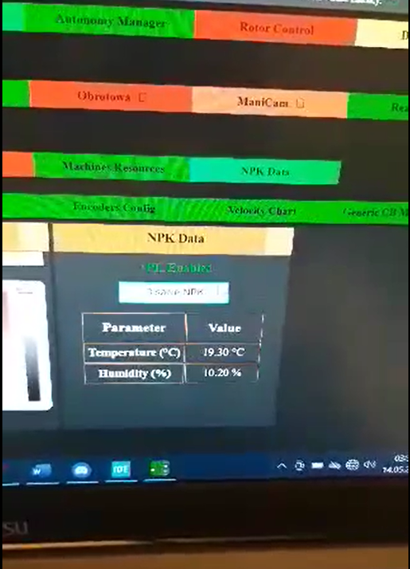

# Czujnik wilgotności gleby oraz temperatury

Oprogramowanie wykonano w ramach pracy dla Koła Naukowego Pojazdów Niekonwencjonalnych "OFF-ROAD" kojarzonego głównie z Projektu Scorpio.
Projekt powstał z myślą o międzynarodowych zawodach łazików marsjańskich University Rover Challenge 2024, a konkretne konkurencji **Science Mission**.

Poniżej przedstawiono docelowe zastosowanie:

