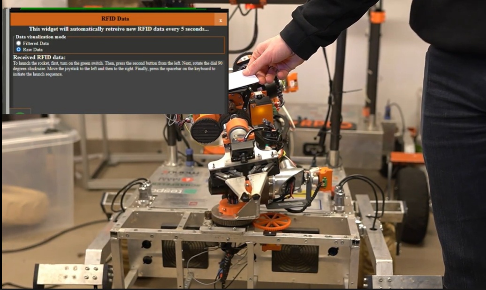

# Czytnik tagów RFID MFRC522

Oprogramowanie wykonano w ramach pracy dla Koła Naukowego Pojazdów Niekonwencjonalnych "OFF-ROAD" kojarzonego głównie z Projektu Scorpio.
Projekt powstał z myślą o międzynarodowych zawodach łazików marsjańskich Australian Rover Challenge 2024, a konkretne konkurencji **Wireless Comunnication**.

Poniżej przedstawiono docelowe zastosowanie:

Urywek z konkurencji można zobaczyć [tutaj](https://www.youtube.com/watch?v=N8DCFYlPOSs&t=23449s) (ogladać od 6:27:05)
